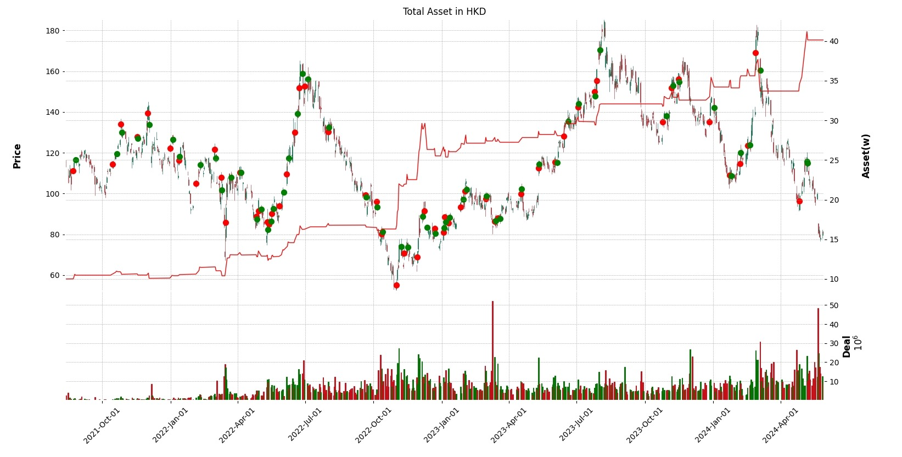

# Yoyo

A quantative trading platform providing the following features:

- Real-time market data fetching
- Real-time trading via Futu API
- Multiple-strategies
- Back testing
- Graphical statistic results



## Get Started

Make sure *virtualenv* is installed.

```
$ git clone https://github.com/yoyo-quant/yoyo.git
$ cd Yoyo
$ virtualenv yoyo-env
$ source yoyo-env/bin/activate
$ pip install -r requirements.txt
```

## Configuration

### Real-time trading & Market data fetching

file path: src/config/stock.json

Just put in the code that you wanna operate on

```json
{
    "stock_code": [
        "HK.09866",
        "HK.02015",
        "HK.09868"
    ]
}
```

### Strategies

file path: src/YoyoStrategy/strategy_cfg.json

configuration for strategies, the concrete parameters shall refer to the function comments

However, there're keywords that can be auto adapt, they work as their name

- buy_above
- buy_below
- sell_above
- sell_below

```json
{
    "StrategyTurtle": {
        "change_rate":{
            "buy_above": 5.0,
            "buy_below": 0.0,
            "sell_above": 0.0,
            "sell_below": 5.0
        }
    }
}
```

### Back testing

file path: src/YoyoStrategy/strategy_manager.json

The manager config is omitted, and the use of each attributes are explained via comments, though json does not support doing so :P

```json
{
    "manager": {
    },
    "back_test":{
        "initial_capital": 100000,
        "tax": 0.0015,				// stamp duty
        "commission": 0,			// commission considering the trading platform
        "full_period": false,			// true for back testing on all dates
        "period": 0,				// if non-zero, the 'end-date' would be omitted and calculated by the start date and period days
        "start_date": "2022-03-14",
        "end_date": "2024-06-18",
        "trade_unit": [1000, 10000, 1000],	// ref: range()
        "min_trade_unit": 100,			// minimum trade unit for a stock
        "test_combinations": [			// combination for strategies on specific stocks
            {
                "stock_code": [
                    "HK.02015",
                    "HK.09866",
                    "HK.09868"
                ],
                "strategy": [
                    "StrategyTurtle"
                ]
            }
        ],
        "use_strategy_cfg": true,
        "strategy_params": {
            "param_stride": 1,			// stride among the ranges
            "StrategyTurtle": {			// as it is configured in the strategy config
                "change_rate":{
                    "buy_above": [-10, 10],
                    "sell_below": [-10, 10]
                }
            }
        }
    }
}
```
